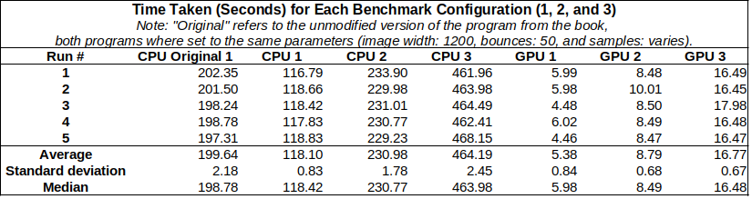
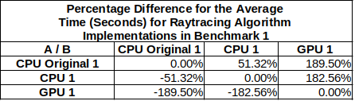

# ray_tracing

> My implementation of "Ray Tracing in One Weekend" using CUDA.


## Overview

[_Ray Tracing in One Weekend_](https://raytracing.github.io/books/RayTracingInOneWeekend.html) is a book by Peter Shirley, Trevor David Black, and Steve Hollasch that introduces the fundamentals of ray tracing. This project is my CUDA-based implementation of the concepts from the book.

The purpose of this project is to learn the basics of ray tracing and to apply fundamental CUDA principles to improve the performance of the ray tracing algorithm.

## Running

To run the project, the NVIDIA CUDA Toolkit must be installed. The compilation process is handled with CMake as follows:

```bash
# Clone the repository
# Navigate to the project directory
mkdir build
cd build
cmake ..
make
./ray_tracing <1, 2, or 3> <gpu or cpu>
```

The first argument specifies the quality level of the output image, where 1 is the lowest quality and 3 is the highest, varying the number of samples per pixel (50, 100, 200). The second argument specifies the device (GPU or CPU) to be used for running the ray tracing algorithm.

## Performance Analysis

Initially, profiling was conducted on the CPU version of the algorithm to identify where most operations were taking place. Some of the profiling data generated can be found in the `profiling` directory.

After implementing the CUDA version of the algorithm, a time analysis was performed to compare the performance of the CPU and GPU versions. Benchmarks were run on a system with a Ryzen 5 5500H CPU, an RTX 2050 GPU with 4GB of VRAM, and 16GB of RAM. This analysis could be enhanced by testing on a variety of hardware configurations and focusing not only on porting the algorithm to CUDA but also on a comprehensive optimization of the algorithm.

The results are shown in the tables below:






